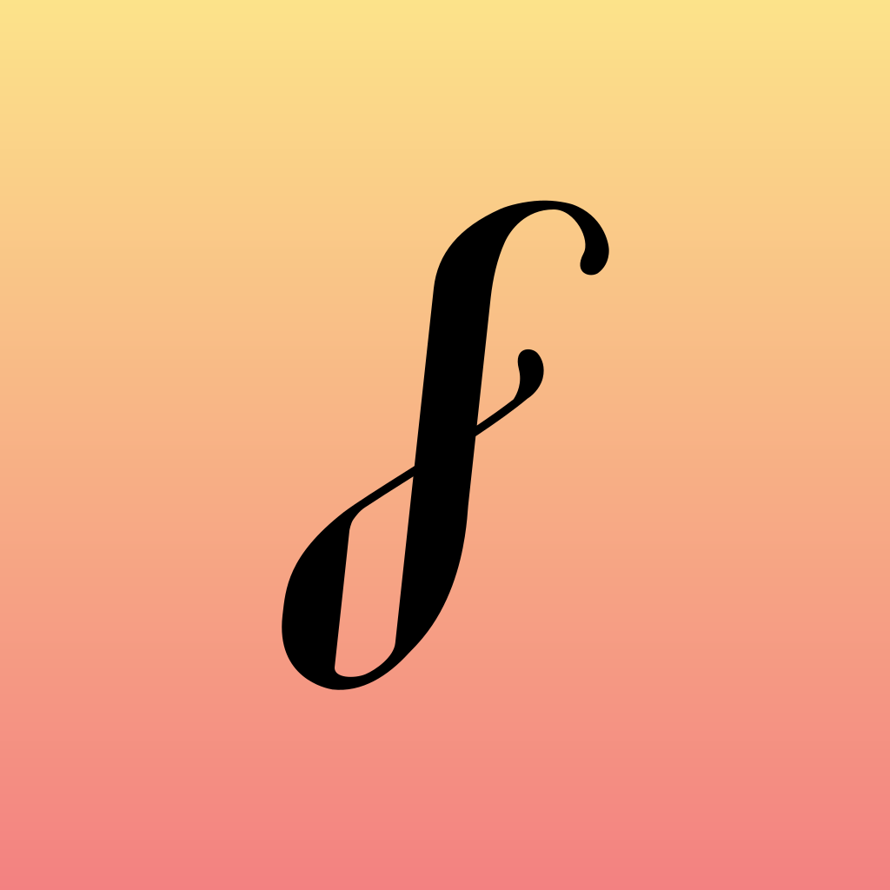
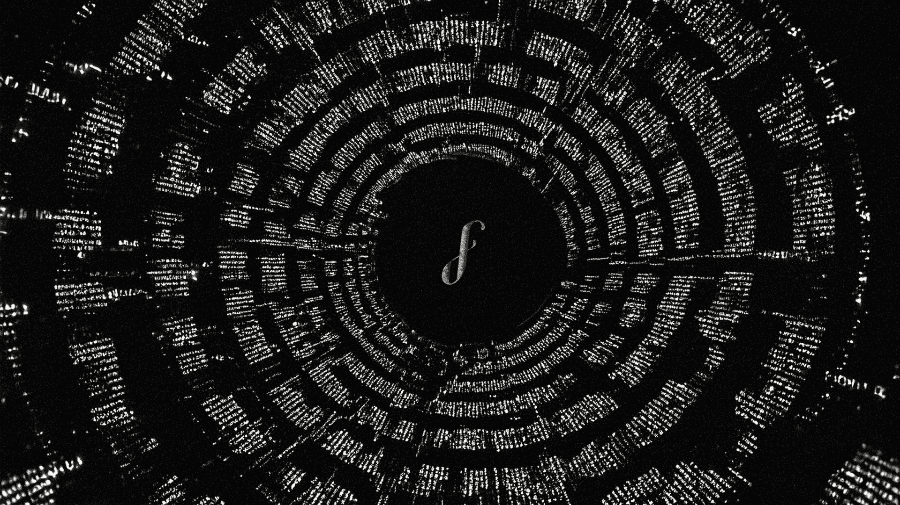

# Forever Library — Brand & Media Kit

Everything needed to refer to, write about, or show Forever Library.
Questions or requests for other formats: open an issue on this repo.

- Website: [foreverlibrary.xyz](https://foreverlibrary.xyz)
- Code: [github.com/foreverlibrary](https://github.com/foreverlibrary)

## Name

**Forever Library**, two words, both capitalized. Not
"ForeverLibrary", not "the Forever Library" in
headlines. The protocol's current deployed contract family is referred to as
Forever Library V3 or "the V3 contracts" when the technical distinction
matters.

## Boilerplate

Short (one line):

> A minting place you can rely on.

Long (one paragraph):

> The Forever Library Protocol is a series of immutable smart contracts,
> live on Ethereum, Tezos, and other leading EVM layer 2 chains, designed
> to preserve digital culture through open, verifiable, and permanent
> minting. No matter your background or creative discipline, it’s a public
> record for onchain creativity accessible to all.

## Logo

The mark is a white long-s "∫" glyph on a filled roundel. The default
roundel is the Ethereum roundel blue `#627EEA`; inside the app the
roundel re-keys to the active chain's accent.

| file | use |
|---|---|
| `logo/fl-mark.svg` | default: blue roundel, white glyph |
| `logo/fl-mark-gradient.png` | black glyph on the warm gradient field (PNG, 1024px) |
| `logo/fl-mark-ink.svg` | monochrome contexts, light backgrounds |
| `logo/fl-mark-paper.svg` | monochrome contexts, dark backgrounds |
| `logo/fl-glyph-black.svg` | glyph only, black on transparent |
| `logo/fl-glyph-white.svg` | glyph only, white on transparent |

Chain-branded variants (the same mark with the roundel re-keyed to the
chain's accent) already live in this repository at
[`assets/chain-marks/v3/`](../assets/chain-marks/v3/).

PNG exports sit next to each SVG (`-1024`, `-256`, plus a `-64` favicon
size for the default mark). Use the SVG whenever the medium allows.

## Banners

The official banner artwork: the FL glyph at the center of a dark vortex
of text, 1920×1080 PNG. Use these for social headers, event graphics,
and press placements.

| file | use |
|---|---|
| `banners/FL_Banner.png` | full-quality master (4.6 MB) |
| `banners/FL_Banner_Comp.png` | compressed copy for web use (365 KB) |

## Color

The palette is gallery-minimal: near-monochrome ink on paper, one
accent. The artwork on screen is the only other color.

Light theme:

| token | hex | role |
|---|---|---|
| paper | `#FAFAFA` | background |
| ink | `#111113` | primary text and marks |
| ink 2 | `#55555C` | secondary text |
| hairline | `#E8E8EC` | borders |
| accent | `#627EEA` | the brand blue (Ethereum roundel blue) |
| accent ink | `#4560C8` | accent for text on paper |
| write | `#FF6B9D` | reserved for write/sign actions |

Dark theme: paper `#0A0A0C`, ink `#F2F2F5`, accent `#7B94F2`.

Chain-branded accents (used only where the chain context is explicit):
Tezos `#0F61FF`, Base `#0052FF`, Arbitrum `#12AAFF`, Soneium `#5B6B7F`,
Shape `#17171A`, MegaETH `#111113`, Robinhood `#CCFF00`.

## Typography

- **Inter Variable** — interface and body text.
- **Instrument Serif** — display and editorial headlines.
- **JetBrains Mono** — addresses, hashes, code, and data.

All three are open-licensed and self-hosted in the app via Fontsource.
Fallbacks: system-ui sans, Georgia serif, ui-monospace.

## License

All Forever Library code is MIT licensed. The mark and this kit are
provided for editorial, community, and integration use; do not use them
to imply endorsement or official status for an unrelated product.
